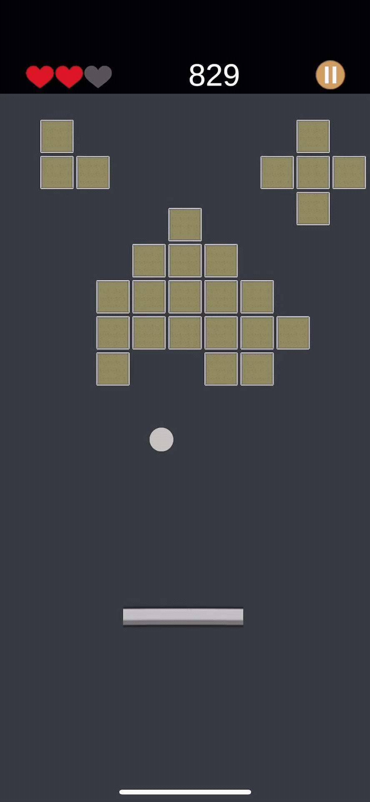

# Arkanoid Game

## Описание
Пользователь управляет платформой, от которой отскакивает шарика. Цель игры - разбить все блоки шариком на уровне.

## Особенности
- Выбор уровня
- Система жизней
- UI: жизни, счёт, главное меню с выбором уровней, меню перезапуска уровня
- Звуковые эффекты: отскок, проигрыш, прохождение уровня

## Установка зависимостей
Для корректной работы проекта необходимо установить следующие пакеты через Unity Package Manager:

1. Откройте Unity → Window → Package Manager.
2. Нажмите "Add package from git URL…" и добавьте:

   - UniTask: `https://github.com/Cysharp/UniTask.git?path=src/UniTask`
   - DOTween: `http://dotween.demigiant.com/download.php` (или через Asset Store)
   - Zenject: `https://github.com/modesttree/Zenject.git`

3. После установки всех пакетов, проект будет готов к открытию и запуску.
